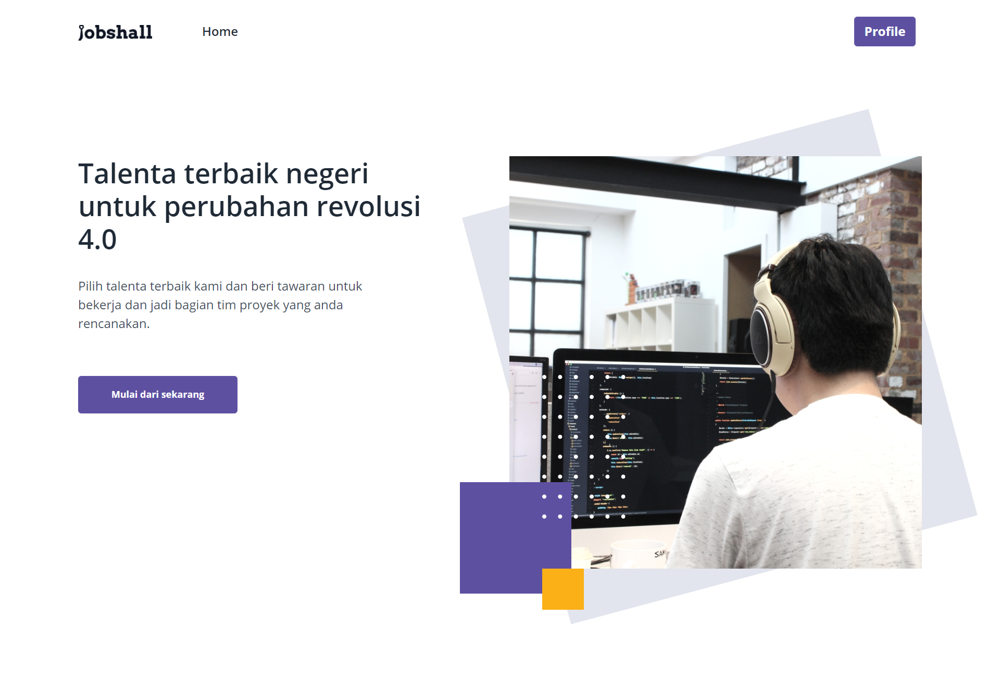
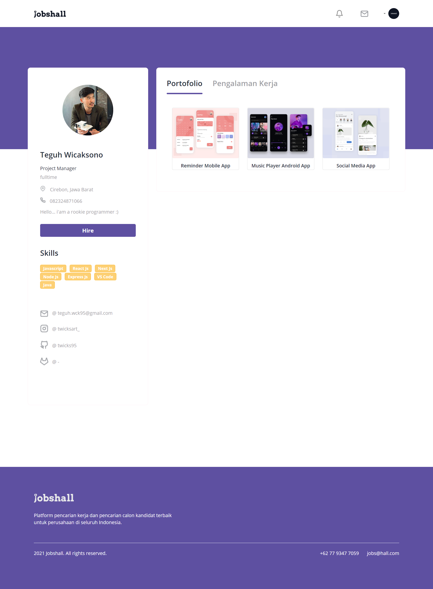

<h1 align='center'>React JS - JobShall </h1>
  <p align="center">
    <a href="https://jobshall.netlify.app">View Demo</a>
    ·
    <a href="https://github.com/twicks95/frontend-jobshall-app/issues">Report Bug</a>
    ·
    <a href="https://github.com/twicks95/frontend-jobshall-app/pulls">Request Feature</a>
  </p>




## About The Project

A website that is used to accommodate workers for later search by company recruiters who need it

## Built With

[](https://github.com/facebook/react)
[](https://github.com/react-bootstrap/react-bootstrap)

## Requirements

1. <a href="https://reactjs.org/docs/getting-started.html">React Js</a>
2. Node_modules `npm install` or `yarn install`
3. Backend API JobShall [`here`](https://github.com/twicks95/backend-jobshall-app.git)

## Features

1. Login & register.
2. Edit personal data (worker / recruiter).
3. Upload & delete profile picture
4. Upload portfolio.
5. Add work experience & list of skills for worker.
6. Find worker by name, skill, location, freelance, fulltime.
7. Send direct email to selected worker.
8. Reset Password.

## Getting Started

1. Download this Project or you can type `git clone https://github.com/twicks95/frontend-jobshall-app.git`
2. Open app's directory in CMD or Terminal
3. Type `npm install` or `yarn install`
4. Add .env file at root folder project

```sh
REACT_APP_ENDPOINT = [Backend API]
```

5. Type `npm run serve`

## Acknowledgements

- [Axios](https://www.npmjs.com/package/axios)
- [React](https://reactjs.org/)
- [React Bootstrap](https://react-bootstrap.github.io/)
- [Bootstrap](https://www.npmjs.com/package/bootstrap)
- [Phosphor React](https://www.npmjs.com/package/phosphor-react)
- [Dotenv](https://www.npmjs.com/package/dotenv)
- [Redux](https://www.npmjs.com/package/redux)
- [Moment](https://www.npmjs.com/package/moment)

## Team

> All Members of Jobshall's Team

|                                  <a href="#" target="_blank">**Team Leader**</a>                                   |                              <a href="#" target="_blank">**Front-End Developer**</a>                              |                                                      <a href="#" target="_blank">**Front-End Developer**</a>                                                      |                               <a href="#" target="_blank">**Back-End Developer**</a>                               |                                <a href="#" target="_blank">**Back-End Developer**</a>                                |
| :----------------------------------------------------------------------------------------------------------------: | :---------------------------------------------------------------------------------------------------------------: | :---------------------------------------------------------------------------------------------------------------------------------------------------------------: | :----------------------------------------------------------------------------------------------------------------: | :------------------------------------------------------------------------------------------------------------------: |
| [](https://github.com/twicks95) | [](https://github.com/twicks95) | [](https://github.com/doyzfin) | [](https://github.com/rifqiziyad) | [](https://github.com/rickyganteng) |
|              <a href="https://github.com/Bagusth15" target="_blank">`https://github.com/twicks95`</a>              |        <a href="https://github.com/link_github_frontend" target="_blank">`https://github.com/twicks95`</a>        |                                <a href="https://github.com/link_github_frontend" target="_blank">`https://github.com/doyzfin`</a>                                 |        <a href="https://github.com/link_github_backend" target="_blank">`https://github.com/rifqiziyad`</a>        |        <a href="https://github.com/link_github_backend" target="_blank">`https://github.com/rickyganteng`</a>        |

---
